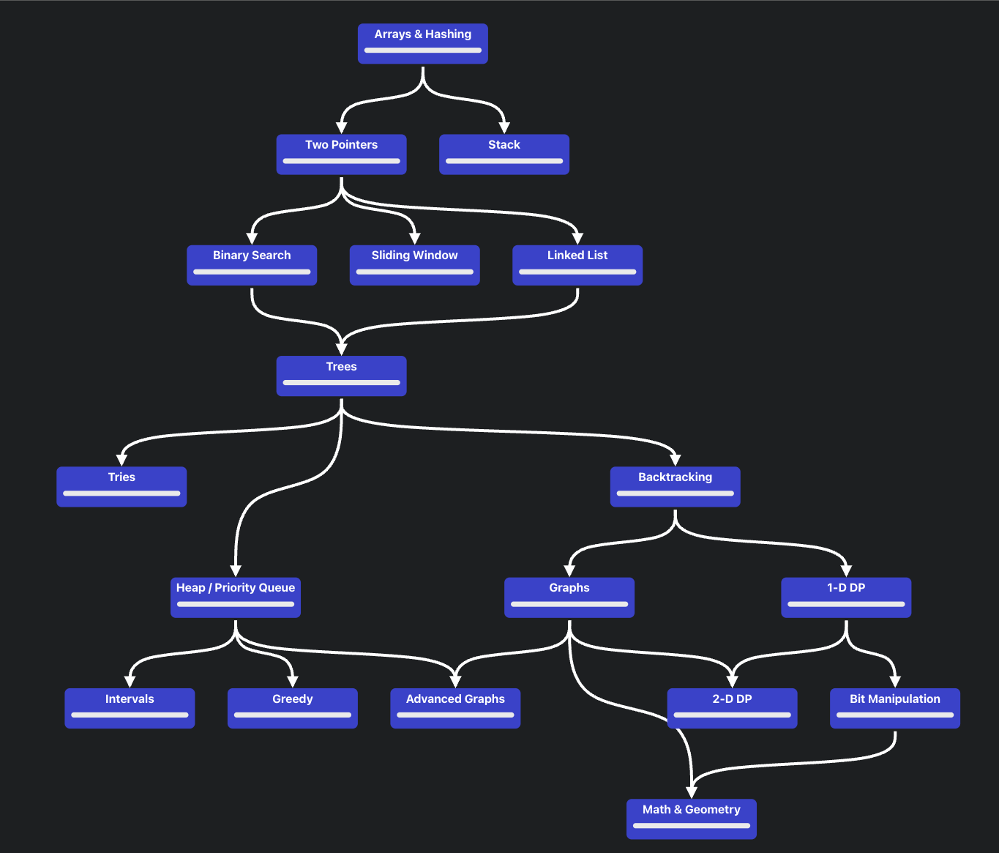

# Workout with Data Structures and Algorithms

## Overview

Welcome to the "Workout with Data Structures and Algorithms" repository! This project is designed to help you strengthen your understanding of fundamental data structures and algorithms through structured practice and problem-solving. Whether you're preparing for coding interviews, improving your problem-solving skills, or simply expanding your knowledge, this repository will guide you through essential concepts and techniques.

## Roadmap

We will follow the roadmap provided by NeetCode to ensure a comprehensive and systematic approach to studying data structures and algorithms. You can access the roadmap here: [NeetCode Roadmap](https://neetcode.io/roadmap).



### Study Structure

The study structure includes various stages, each focusing on different aspects of data structures and algorithms. The goal is to build a solid foundation and gradually advance to more complex topics. The key stages are:

1. **Introduction to Data Structures**
   - Arrays
   - Linked Lists
   - Stacks
   - Queues

2. **Advanced Data Structures**
   - Trees
   - Graphs
   - Hash Tables
   - Heaps

3. **Algorithmic Techniques**
   - Sorting and Searching
   - Recursion and Backtracking
   - Dynamic Programming
   - Greedy Algorithms

4. **Complexity Analysis**
   - Time Complexity
   - Space Complexity

5. **Practical Applications**
   - Real-world problems
   - Coding challenges

## Getting Started

1. **Clone the Repository**

   ```bash
   git clone <repository-url>
   cd <repository-directory>
   ```

2. **Install Dependencies**

   Depending on the tools and languages you use, you may need to install specific dependencies. Check each problem's requirements for more details.

3. **Explore the Repository**

   - **/problems:** Contains the coding problems and their solutions.
   - **/notes:** Includes detailed notes and explanations for each data structure and algorithm.
   - **/resources:** Links to additional resources, such as articles, videos, and tutorials.

4. **Start Practicing**

   Follow the roadmap and start solving problems. Each problem is categorized by difficulty level to help you progress systematically.

## Contributing

Feel free to contribute to this repository by adding new problems, improving existing solutions, or updating notes. To contribute:

1. Fork the repository.
2. Create a new branch (`git checkout -b feature/your-feature`).
3. Make your changes and commit them (`git commit -am 'Add new feature'`).
4. Push to the branch (`git push origin feature/your-feature`).
5. Create a Pull Request.

## Contact

If you have any questions or feedback, please reach out to [your-email@example.com].

## License

This project is licensed under the MIT License - see the [LICENSE](LICENSE) file for details.